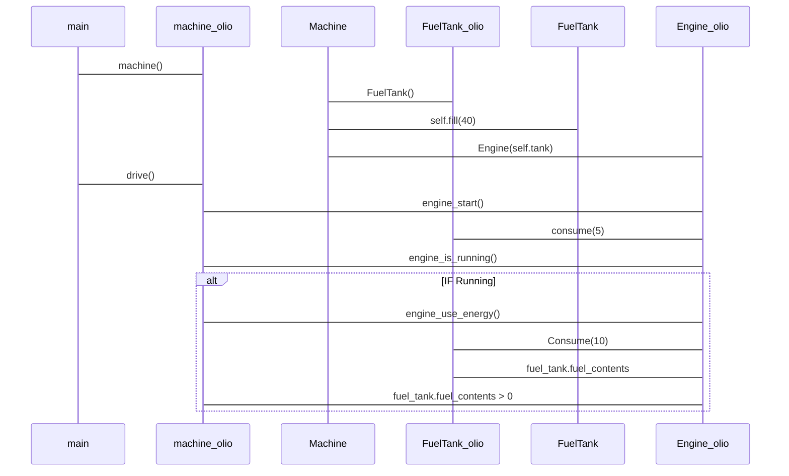

```mermaid
sequenceDiagram
main -> machine_olio: machine()
Machine -> FuelTank_olio: FuelTank()
Machine -> FuelTank: self.fill(40) 
Machine -> Engine_olio: Engine(self.tank)
main -> machine_olio: drive()
machine_olio -> Engine_olio: engine_start()
Engine_olio -> FuelTank_olio: consume(5)
machine_olio -> Engine_olio: engine_is_running()
alt  IF Running
    machine_olio->Engine_olio: engine_use_energy()
    Engine_olio->FuelTank_olio: Consume(10)
    FuelTank_olio->Engine_olio:fuel_tank.fuel_contents
    Engine_olio->machine_olio: fuel_tank.fuel_contents > 0
end

```

