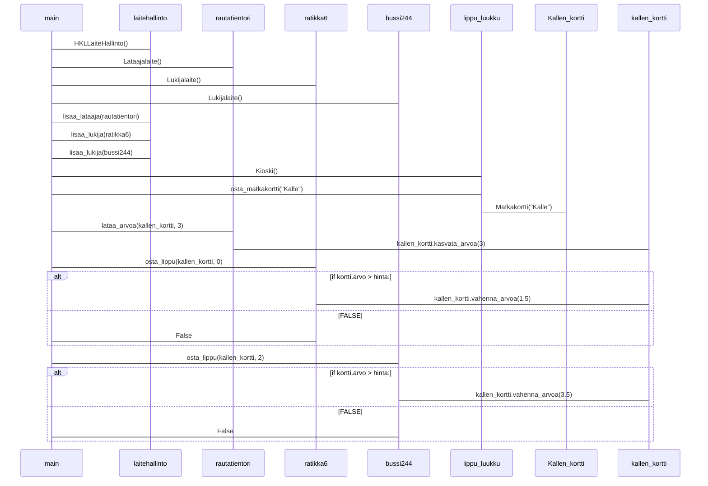

```mermaid
sequenceDiagram
main -> laitehallinto: HKLLaiteHallinto()
main -> rautatientori: Lataajalaite()
main -> ratikka6: Lukijalaite()
main -> bussi244: Lukijalaite()
main -> laitehallinto: lisaa_lataaja(rautatientori)
main -> laitehallinto: lisaa_lukija(ratikka6)
main -> laitehallinto: lisaa_lukija(bussi244)
main -> lippu_luukku: Kioski()
main -> lippu_luukku: osta_matkakortti("Kalle")
lippu_luukku -> Kallen_kortti: Matkakortti("Kalle")
main -> rautatientori: lataa_arvoa(kallen_kortti, 3)
rautatientori -> kallen_kortti: kallen_kortti.kasvata_arvoa(3)
main -> ratikka6: osta_lippu(kallen_kortti, 0)
alt if kortti.arvo > hinta:
    ratikka6 -> kallen_kortti: kallen_kortti.vahenna_arvoa(1.5)
else FALSE
    ratikka6->main: False
end
main -> bussi244: osta_lippu(kallen_kortti, 2)
alt if kortti.arvo > hinta:
    bussi244 -> kallen_kortti: kallen_kortti.vahenna_arvoa(3.5)
else FALSE
    bussi244->main: False
end


```
