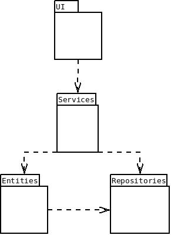
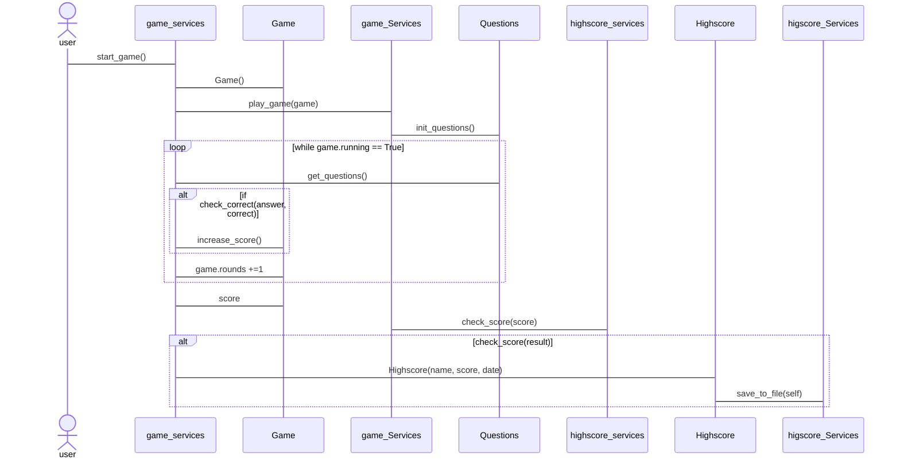

# Arkkitehtuuri

- Ohjelmassa on pyritty noudattamaan kurssilla esiteltyä mallia.

## Repositories:

- Luokka Questions vastaa kysymyspakettien luomisesta.

## Entities:

- Luokka Game toimii peli objektina ja säilyttää ajankohtaisen pelitilanteen.
- Luokka Highscores on malli tallennettavalle huipputulokselle.

## Services:

- Connection_services vastaa tietokantaan yhdistämisestä
- game_services sisältää itse pelin toiminnan mahdollistavat funktiot. Se hankkii kysymykset ja looppaa pelin läpi. Hoitaa vastausten
tarkistamisen.
- highscore_services hoitaa yhteyden highscore.cvs tiedoston kanssa ja tallentaa sekä näyttää huipputulokset.
- question_services hankkii raakaa dataa tietokannasta luokalle questions.
- ui_services tarjoaa käyttöliittymälle indeksintarkistuksen.

## Käyttöliittymä

- Käyttöliittymä on toteutettu yhdellä ikkunalla, samaa näkymää päivittäen.

## Kysymystietokanta ja tulokset

- Kysymysten aineisto säilytetään data.db tietokannassa.
- Tietokannassa on kaksi taulua. Countires ja cities.
- Countries taulussa on kentät name, cca2, capital.
- Cities taulussa on kentät cca2 ja name.

- Tulokset tallennetaan Higscores.cvs tiedostoon muodossa: juha,10,2022-12-25
- Ensimmäinen kenttä on käyttäjän nimi, toinen pisteet ja kolmas päivämäärä.

## Pelin sekvenssikaavio
- Yksinkertainen kuvaus pelin toiminnasta.

