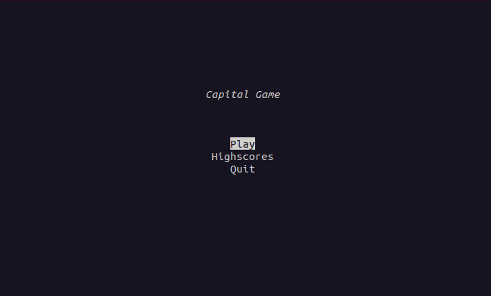
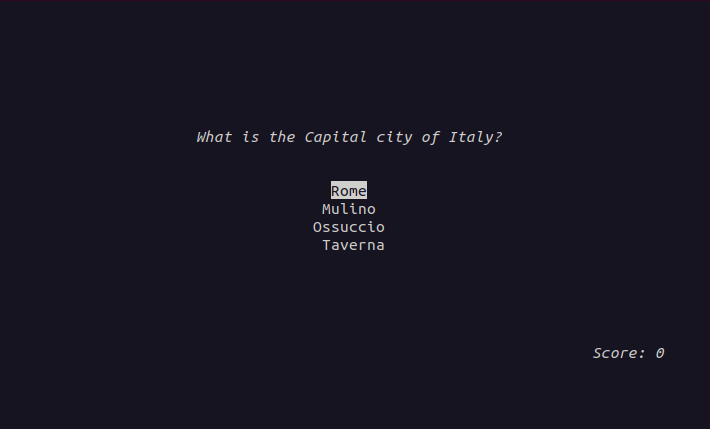
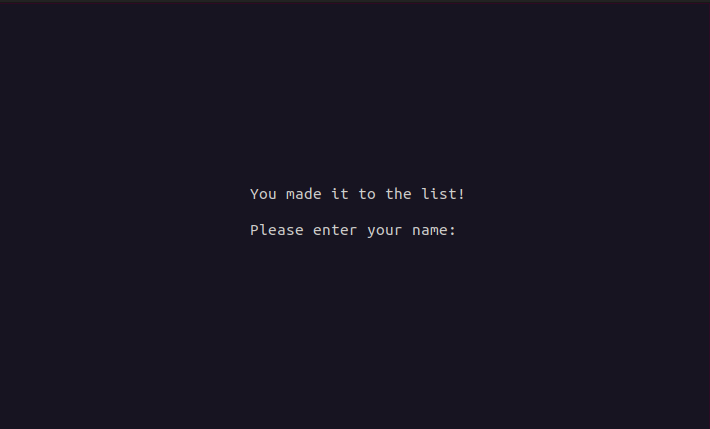

# Käyttöohje

## Käynnistäminen

- Ennen ohjelman käynnistämistä suorita python-quiz kansiossa komento:


```bash
poetry install
```
- Käynnistä ohjelma komennolla:

```bash
poetry run invoke start
```

## Käyttöohje

- Ohjelma käynnistyy seuraavassa näkymässä:



- Voit liikkua ylös tai alas nuolinäppäimillä ja hyväksyä valinnan enterillä tai välilyönnillä.
- Play aloittaa uuden pelin.
- Higscores tulostaa näytölle huipputulokset.
- Quit lopettaa ohjelman suorituksen.

## Pelaaminen

- Kun olet aloittanut pelin, esittää peli sinulle 10 pääkaupunkiaiheista kysymystä,
joihin sinun pitään yrittää vastata oikein 4 vaihtoehdosta.
- Voit valita kaupungin nuolinäppäimillä ylös tai alas, ja hyväksyä valinnan enterillä
tai välilyönnillä.
- Alareunassa näkyy ajankohtainen pistetilanne. 



- Mikäli sait pelin päättyessä tarpeeksi pisteitä saadaksesi nimesi top-10 listalle,
kysyy peli sinulta nimeä. Voit syöttää max 15 merkkiä.

 


## Muita ohjeita

- Pelin aikana on hyvä välttää terminaali-ikkunan koon pienentämistä.
