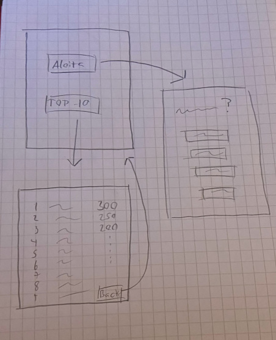

# Vaatimusmäärittely

## Sovelluksen tarkoitus

Sovellus on tietovisa, jossa tarkoituksena on vastata mahdollisimman moneen kysymykseen oikein. Aiheena pääkaupungit.

## Käyttäjät

Sovelluksessa on vain yksi käyttäjärooli

## Toiminnallisuus

-Sovelluksessa on aloitusnäyttö, mistä on mahdollisuus aloittaa uusi peli tai tarkastella tuloksia. Tuloksista voi palata
aloitusnäyttöön ja pelin loppuessa peli siirtyy tulosnäytölle.

-Käyttäjän aloittaessa pelin, kysyy sovellus käyttäjältä ennalta määrätyn määrän kysymyksiä ja
pelaaja saa pisteitä vastatatessaan oikein.

-Kysymykset tallennetaan tietokantaan.

-Pelin päätyttyä pelaaja syöttää nimensä ja pisteet tallennetaan. Pelaaja voi nyt verrata tulostaan aikaisempiin
pelaajiin.

## Jatkokehitysideoita

-Pisteiden tallennus online.

## Tähän mennessä tehty

-Kysymystietokanta kunnossa
-Kysymykset voidaan hakea tietokannasta.
-Alustava komentorivikäyttöliittymä.
-Pisteiden tallennus

## Tekemättä

-Graafinen käyttöliittymä

